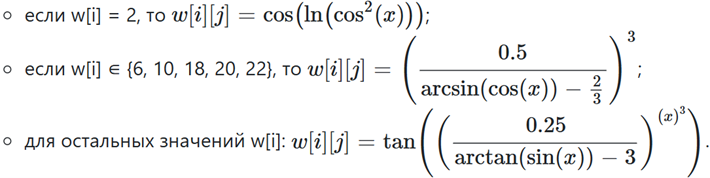

# Лабораторная работа #1

Написать программу на языке Java, выполняющую указанные в варианте действия.

## Вариант - 32982
1. Создать одномерный массив w типа long. Заполнить его чётными числами от 2 до 22 включительно в порядке возрастания.
2. Создать одномерный массив x типа double. Заполнить его 16-ю случайными числами в диапазоне от -3.0 до 6.0.
3. Создать двумерный массив w размером 11x16. Вычислить его элементы по следующей формуле (где x = x[j]):
    
    
4. Напечатать полученный в результате массив в формате с пятью знаками после запятой.